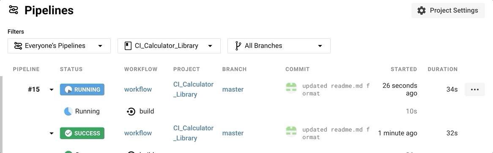
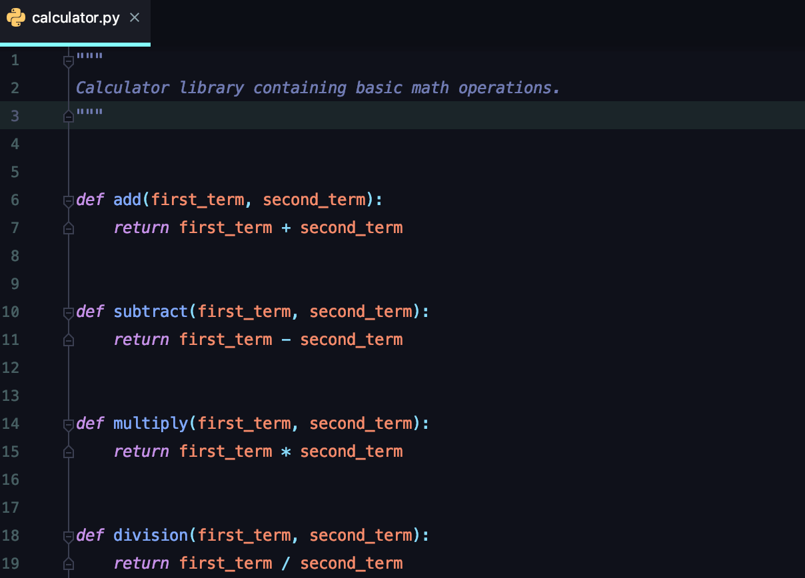
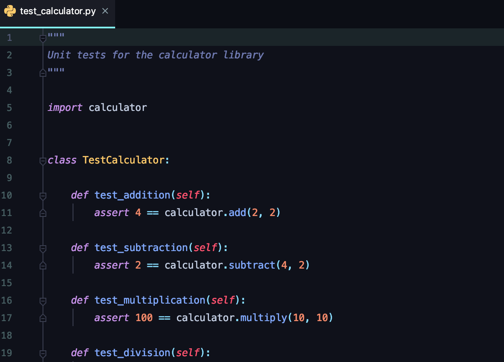
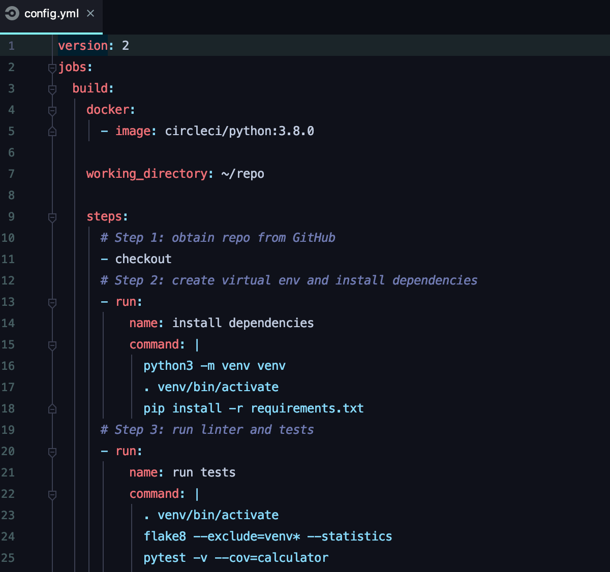

# Continuous Integration Configuration
Continuous integration configuration example using CircleCI.  A simple calculator app with a handful of tests that build and run on CircleCI.

[CircleCI Pipeline](https://app.circleci.com/pipelines/github/rgluys/CI_Calculator_Library)

# Calculator Library

Basic math functions that accept 2 terms for add, subtract, multiply and divide:

A true, positive test case for each function.  Unit tests used to demonstrate CircleCI integration:

CircleCI configuration setup using Version 2.0.  Three step process in the pipeline which includes obtaining the repository from Github, installing the project dependencies and running the unit tests:

# Sources
CI/CD Tutorial: https://realpython.com/python-continuous-integration/

